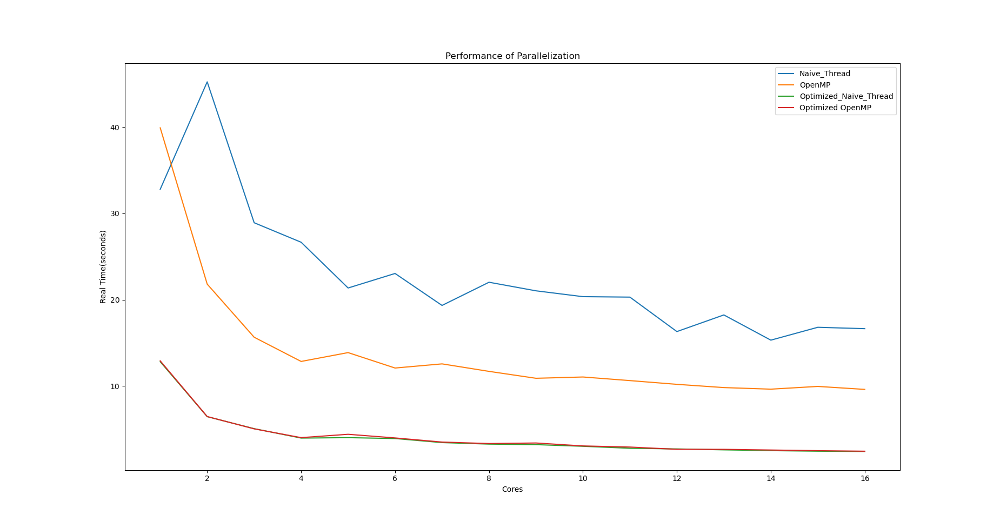

# OSDI Midterm Project

HW_5: Using pthread to calculate pi

Name/ID: Sylvex Hung/612410065

## What Does the Program Do?

It calculate pi upper bound and lower bound by calculate the area of quarter circle area. The way it calculate the area is simply divide the area to several rectangle verticle to the x-axis.

There are 3 program in this project: ```no_thread```, ```naive_thread```, ```openmp```.

- no_thread.c (Calculating pi with no thread)
- naive_thread.c (Calculating pi with the threading model that I designed)
- openmp.c (Parallized by openmp)

You can specify thread number with ```-t``` and specify the division number with ```-n```

The sample input and output:

```
# input:
./no_thread -n 10
```

```
# output:
Number of division: 10
upper pi_value: 3.304518326248318
lower pi_value: 2.904518326248318
```

```
# input:
./naive_thread -t 16 -n 10000000000
```

```
# output:
Number of available CPU: 16
Number of running CPU: 16
Number of division: 10000000000
upper pi_value: 3.141592653789842
lower pi_value: 3.141592653389843
```

To build it, simply use cmake to build it.

For example:

```
mkdir build
cd build
cmake ..
make
```

## Specs:

```
OS: Ubuntu 22.04.3 LTS x86_64 
Host: Aspire A715-51G V1.04 
Kernel: 6.2.0-36-generic 
CPU: 12th Gen Intel i7-1260P (16) @ 4.700GHz 
Memory: 3564MiB / 15688MiB
```

## The Answer to the documents:

1. What is the computation time that derive from the command ```time```? And explain the meaning of ```real```, ```user```, ```sys```.
    - The best performance of my thread model is with optimization flag turned on under the precision of 9th decimal point and division 1e10:

    |real|user|sys|
    |---|---|---|
    |2.431s|34.000s|0.005s|

    Compared to the original no thread with no optmization turned on:
    |real|user|sys|
    |---|---|---|
    |44.198s|44.183s|0.000s|

    Unfair comparison: I've got 1818% performance boost!

    More result can be found in the result.txt!
    
    - In ```time```: 
        - ```real``` means the time elapsed in real world.
        - ```user``` means the time spent on CPU in user mode.
        - ```sys``` means the time spent on CPU in kernel mode.
        - The time in ```user``` and ```sys``` will add up accross CPU core.
2. Performance through out the core: (n=1e10) (precision accurate to the 9th decimal point)

       
3. Special way to speed up the computation:

    1. Instead of calculate upper and lower bound respectively every iteration in a loop, we can calculate lower bound using the last upper bound value:
        ```
            double local_upper = f((start) * width) * width;
            double local_lower = 0.0;
            for (; start < end; start++)
            {
                params->local_upper_sum += local_upper;
                local_lower = f((start + 1) * width) * width;
                params->local_lower_sum += local_lower;
                local_upper = local_lower;
            }

        ```
    2. Lets say division n = 1600, thread t = 16, we separate 0~99, 100~199, ... 900~999 th division and calculate the thread local sum respectively. After thread joined, simply add those 16 sum together.
    3. The Optimized and normal is simply setting the compiler flag: ```-O3 -ffast-math```, the ```-ffast-math``` is an aggressive optimization sacrificing some precision for performance. For this, the precision is acceptable so far. For my implementation, the precision both drift away at 10th decimal point no matter the ffast-math is on or not. 
    4. Do not share the data between threads! The local sum in a thread is independant!


## What I've discorvered:

- For reusing the result for last iteration, its not much of speed up or even slower, it really depends on the optimization of compiler. For single threaded, non-optimized flag it do have 37% speed up, but not multithreaded.
- OpenMP seems to have better parallel performance when compiler has no optimize flag. My thread model performance fluctuate a lot in comparison.
- With the optimize flag turned on, the performance is consistent, and gain 300% to 680% speed up.
- ```-fsanitize=thread``` can help you resolve the data race, which turns out extremely helpful for debugging.
- ```getopt``` is helpful for setting the flag and better testing.

## What I can improve

- I have no good way to convert the division and precision together. I simply run several division number to get the target precision.
- I was hoping for getting to 10th decimal ponit, maybe there's too many incremental error. I have no good way to compute that precise.
- Different thread number may introduce slight number fluctuation, I believe it's due to the division is not associative. Which is caused by the precision loss and no guarantee which thread local sum is complete first.